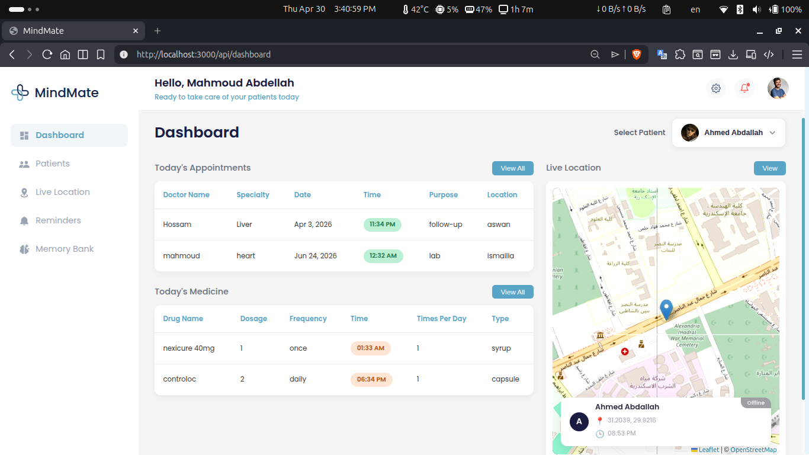
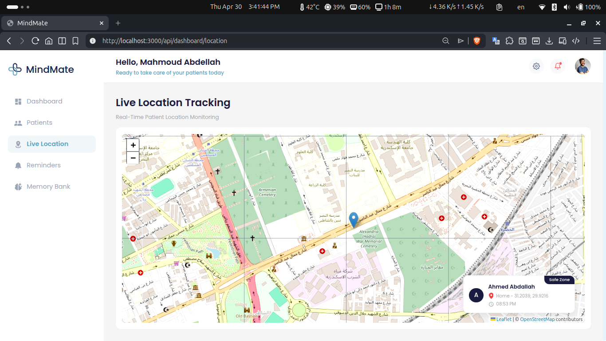
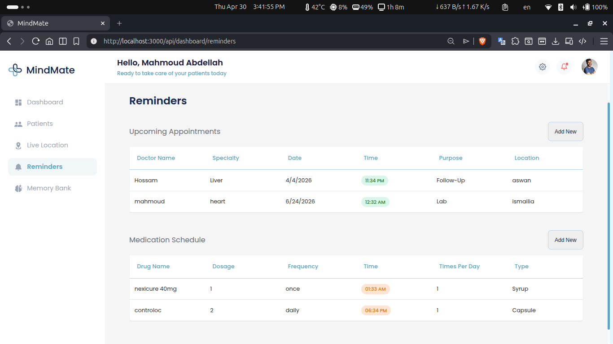
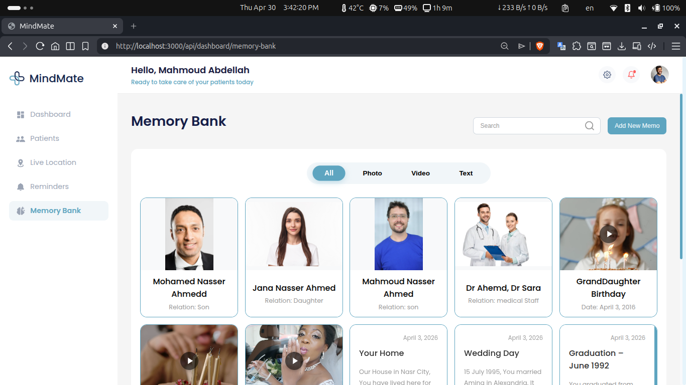
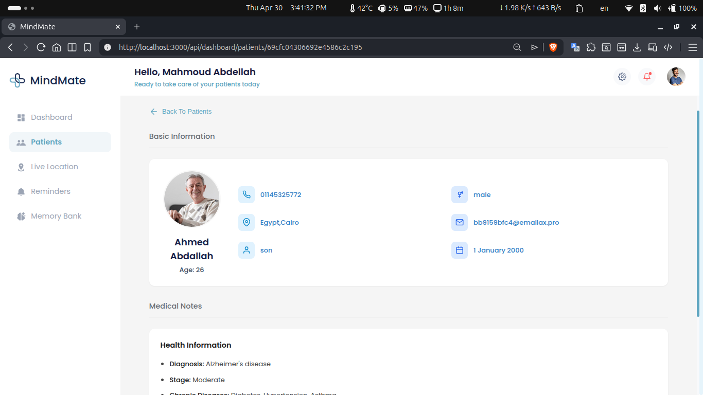

<div align="center">
  

# MindMate 🧠💙

<h3>Smart care. Safer lives. Stronger connections.</h3>

[](https://reactjs.org/)
[](https://redux-toolkit.js.org/)
[](https://socket.io/)
[](https://leafletjs.com/)

</div>

<br />

## 📖 About The Project

<h3>MindMate is an intelligent, compassionate web application</h3>
<p>It is designed to support Alzheimer's patients and empower their caregivers. Managing the daily challenges of Alzheimer's requires constant attention, and MindMate bridges the gap by offering a cohesive dashboard for caregivers to monitor, assist, and care for their loved ones effectively.</p>

<p>From real-time geographical tracking to therapeutic memory banks, the application acts as a digital companion that ensures patients' safety while significantly reducing caregiver burnout.</p>

<div align="center">
  
  <p><em>Caregiver Dashboard & Real-Time Tracking</em></p>
</div>

---

## ✨ Features & Interface

<h4>We have built specific modules to tackle the everyday challenges faced by caregivers:</h4>

<table width="100%">
  <tr>
    <td align="center" width="50%">
      
      <br/><br/>
      <h3>📍 Real-Time Location Tracking</h3>
      <p>Integrated Leaflet maps & Socket.io for live geolocation updates.</p>
    </td>
    <td align="center" width="50%">
      
      <br/><br/>
      <h3>💊 Smart Reminders</h3>
      <p>Granular scheduling for Medications and Appointments.</p>
    </td>
  </tr>
  <tr>
    <td align="center" width="50%">
      
      <br/><br/>
      <h3>🖼️ Memory Bank</h3>
      <p>A therapeutic vault for photos, notes, and cherished milestones.</p>
    </td>
    <td align="center" width="50%">
      
      <br/><br/>
      <h3>👥 Patient Management</h3>
      <p>Easily add, edit, and oversee multiple patient profiles.</p>
    </td>
  </tr>
</table>

- **🔐 Secure Authentication:** Complete onboarding flows including Sign Up, Login, and Password Recovery.

---

## 🛠 Tech Stack

**Frontend Framework & Libraries:**

- **React 18** (Bootstrapped with Create React App)
- **React Router v7** (Dynamic client-side routing & protected routes)
- **Redux Toolkit** (Global state management)

**Integration & Functionality:**

- **Axios** (RESTful API communication)
- **Socket.io-Client** (WebSockets for real-time tracking)
- **Leaflet & React-Leaflet** (Interactive maps for patient location)
- **React Toastify & React Modal** (Intuitive UI feedback and dialogs)

---

## 🚀 Getting Started

Follow these instructions to get a local copy of the project up and running.

### Prerequisites

Make sure you have Node.js and npm installed on your machine.

- npm
    ```sh
    npm install npm@latest -g
    ```

### Installation

1. **Clone the repo**
    ```sh
    git clone https://github.com/MindMate-Project/Web.git
    ```
2. **Navigate to the project directory**
    ```sh
    cd alzheimer
    ```
3. **Install NPM packages**
    ```sh
    npm install
    ```
4. **Setup Environment Variables**
    - Create a `.env` file in the root directory.
    - Add your API Base URLs and other secrets (e.g., `REACT_APP_API_URL=http://localhost:5000/api`).
5. **Start the development server**
    ```sh
    npm start
    ```

---

## 📂 Project Structure

```text
src/
├── API/             # Axios instances and API route configurations
├── components/      # Reusable UI components (Auth, Dashboard, Maps, Navigation)
├── hook/ & hooks/   # Custom React hooks containing abstracted logic & API calls
├── images/          # Static graphical assets
├── pages/           # High-level layouts and routed pages
├── redux/           # Redux store, slices, and asynchronous thunks
└── utils/           # Helper functions and Route Protection wrappers
```

---

<div align="center">
  <b>Built with ❤️ for a better tomorrow.</b>
</div>
